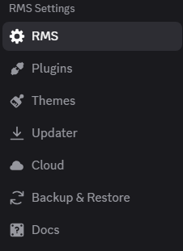

# RMS — Discord Client Mod

> A powerful Discord client modification with plugins, themes, and more.

---

## What is RMS?

RMS is a modification for Discord's desktop app. It lets you extend Discord with plugins that add new features and themes that change how it looks — without touching Discord's files in any unsafe way.

## Features

- **Plugins** — Enable powerful mods like FakeNitro, NoTrack, SilentTyping, MessageLogger, and many more
- **Themes** — Load CSS themes from a URL or write your own with the built-in QuickCSS editor
- **Auto Updater** — Automatically checks for and applies updates from GitHub releases
- **Cloud Sync** — Back up and restore your settings across devices
- **Docs Tab** — Built-in documentation right inside Discord's settings panel
- **No Tracking** — NoTrack plugin disables Discord's analytics by default

## Installation

### Quick Install (Recommended)

1. Download the latest `RMSInstaller.zip` from [Releases](https://github.com/zxkuhl/RMS/releases/latest)
2. Extract the zip
3. Right-click `RMSInstaller.exe` → Properties → check **Unblock** → OK
4. Run `RMSInstaller.exe`
5. Accept the license and click **Install**
6. Restart Discord

> If Windows SmartScreen blocks it, click **More info → Run anyway**

## Usage

After installing, open Discord Settings (gear icon) and scroll down to find the **RMS Settings** section. From there you can:

- Enable/disable plugins
- Load themes
- Edit QuickCSS
- Check for updates
- Back up your settings

## Updating

Open Discord Settings → RMS → Updater → **Check for Updates**. If an update is available click **Update** and restart Discord.

## Uninstalling

Run `RMSInstaller.exe` again and click **Uninstall**. Restart Discord.

## File Locations

| Path | Contents |
|------|----------|
| `%AppData%\RMS\dist\` | RMS built files |
| `%AppData%\RMS\settings\settings.json` | Plugin settings |
| `%AppData%\RMS\settings\quickCss.css` | QuickCSS |
| `%AppData%\RMS\themes\` | Local theme files |

## Disclaimer

RMS is an unofficial modification for Discord. It is not affiliated with, endorsed by, or supported by Discord Inc. Use of this software may violate Discord's Terms of Service. Use at your own risk.

## License

Copyright © 2026 zxkuhl. All rights reserved.

This software is proprietary. You may not modify, redistribute, or use any part of it in your own projects without express written permission from zxkuhl. See [LICENSE](./LICENSE) for full terms.

## Support

- 📖 [Wiki](https://zxkuhl.github.io/RMS/wiki/)
- 🐛 [Issues](https://github.com/zxkuhl/RMS/issues)
- ❤️ [Sponsor](https://github.com/sponsors/zxkuhl)

- ## UI Preview

